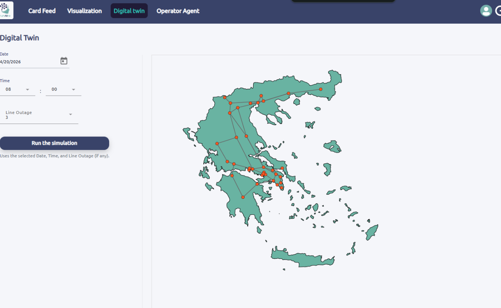
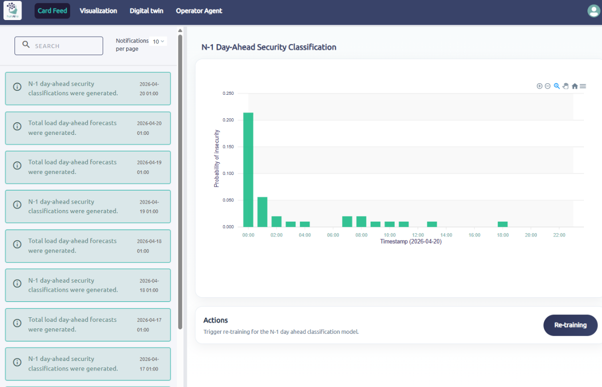
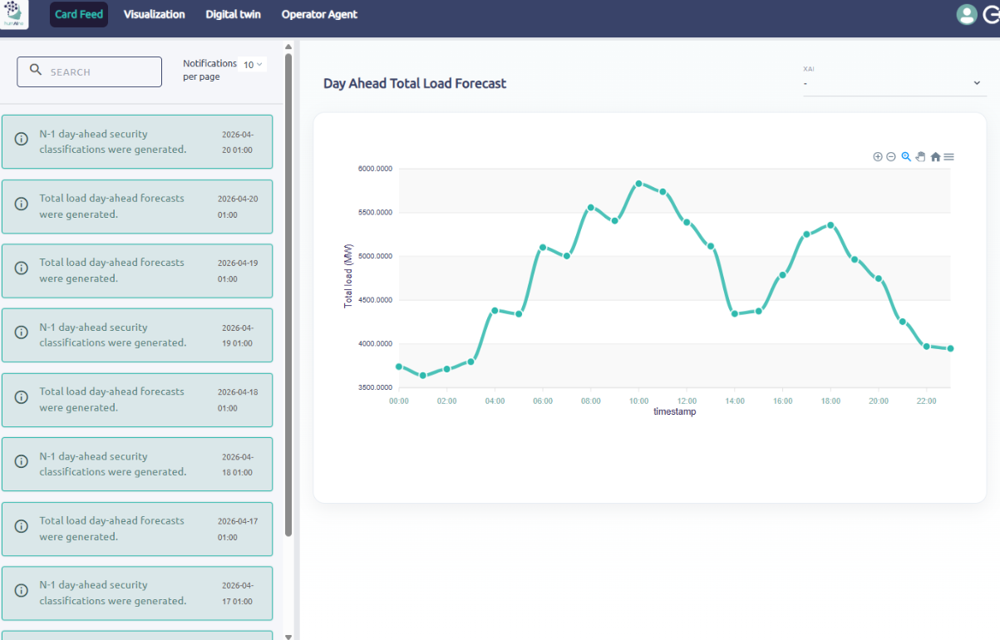
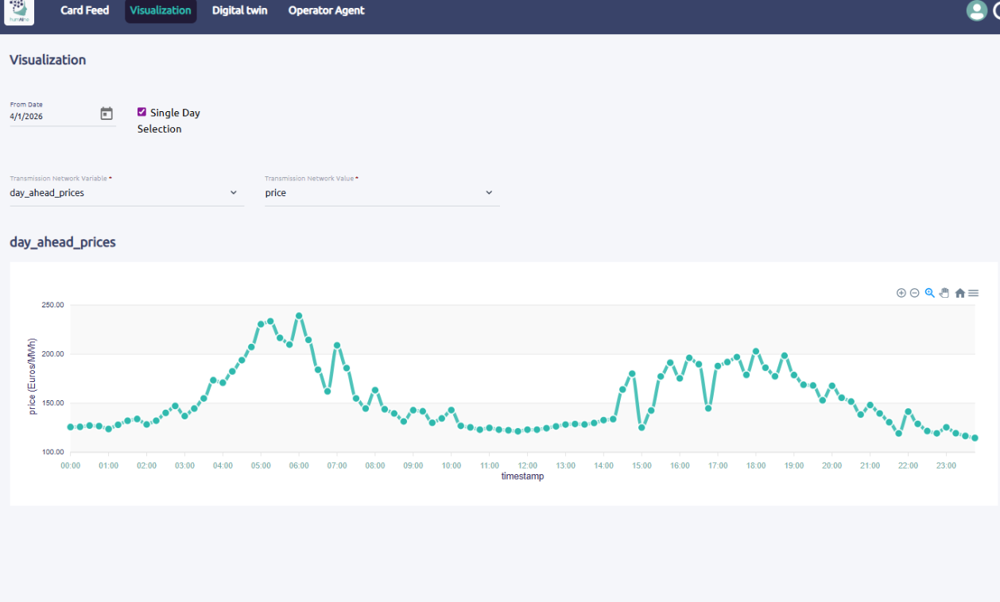
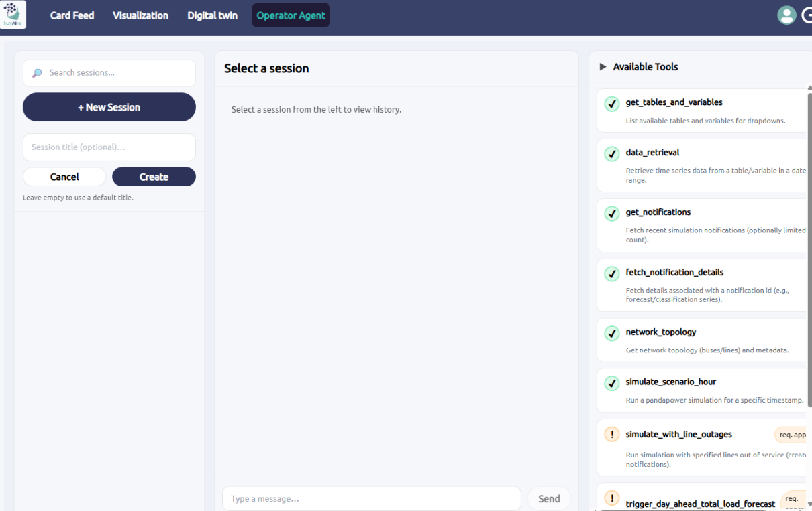
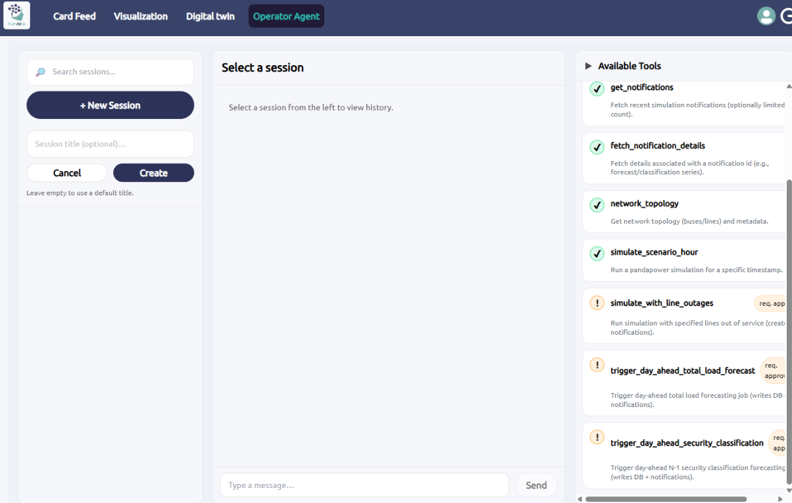

# HumAIne Dashboard - User Guide

Welcome to the **HumAIne Dashboard**, an interactive platform for monitoring and managing power grid security with active learning capabilities.

**Platform URL:** https://humaine-dashboard.euprojects.net/

---

## Table of Contents

1. [Getting Started](#getting-started)
2. [Dashboard Overview](#dashboard-overview)
3. [Key Features](#key-features)
4. [User Interface Components](#user-interface-components)
5. [Workflow Guide](#workflow-guide)

---

## Getting Started

### Authentication

#### Existing Users
To log in with your existing credentials:
1. Navigate to https://humaine-dashboard.euprojects.net/
2. Enter your username and password
3. Click **Login**

#### New Users
To create a new account:
1. Click **Register** on the login page
2. Enter your desired username and password
3. Click **Create Account**
4. You will be redirected to the platform

---

## Dashboard Overview

The HumAIne Dashboard consists of four main sections, each accessible via the navigation tabs at the top:

### 1. **Card Feed**
Displays a chronological log of system events and operations:
- Forecast generation events
- Security classification results
- System notifications

Use the search functionality to filter logs by keyword.

### 2. **Visualization**
Interactive time-series visualizations for monitoring key grid variables:
- Day-ahead electricity prices
- Total load forecasts
- Other transmission network metrics

**Select a single day** to analyze detailed time-series data within the 24-hour window.

### 3. **Digital Twin**
Simulates power grid behavior under various conditions:
- Set the **Date** and **Time** for simulation
- Select **Line Outages** to simulate N-1 contingency scenarios
- Click **Run the simulation** to execute the simulation and visualize grid impacts

### 4. **Operator Agent**
Provides an interface for triggering operational tasks and simulations:
- **Available Tools** (right panel):
  - `get_tables_and_variables`: List available data tables and variables
  - `data_retrieval`: Retrieve time-series data for analysis
  - `get_notifications`: Fetch recent system notifications
  - `network_topology`: View network topology and metadata
  - `simulate_scenario_hour`: Run simulations for specific timestamps
  - `simulate_with_line_outages`: Run N-1 contingency simulations (requires approval)
  - `trigger_day_ahead_total_load_forecast`: Trigger load forecasting job (requires approval)
  - `trigger_day_ahead_security_classification`: Trigger security classification (requires approval)

Session management is available on the left panel.

---

## Key Features

### N-1 Day-Ahead Security Classification

The dashboard displays the **predicted probability of insecure system states** over a 24-hour period, computed by the Active Learning-based security classifier.

**Interpretation:**
- High peaks indicate time windows with elevated security risk
- Use the **Re-training** button to trigger model retraining with updated data

### Day-Ahead Load Forecast

View predicted total electricity demand across the day.

### Day-Ahead Electricity Prices

Monitor day-ahead market prices over the 24-hour period.

---

## User Interface Components

### Card Feed

The left sidebar shows timestamped event notifications:
- Click to expand for more details
- Search functionality to filter events
- Notifications pagination (10 per page)

### Operator Agent Interface

Available tools are color-coded:
- ✅ **Green (Available)**: Ready to use without approval
- 🟡 **Orange (Requires Approval)**: Needs authorization to execute

Create and manage analysis sessions:
1. Click **+ New Session** to start a new session
2. Enter a session title (optional)
3. Click **Create**
4. Use the session to run multiple tools and experiments

---

## Workflow Guide

### Typical User Workflow

1. **Monitor Security Status**
   - Go to **Card Feed** to review recent events
   - Check the **N-1 Day-Ahead Security Classification** graph for risk levels

2. **Analyze Grid Conditions**
   - Use **Visualization** to inspect load forecasts and prices
   - Identify critical time periods or patterns

3. **Run Simulations**
   - Go to **Digital Twin**
   - Select a date, time, and line outage scenario
   - Click **Run the simulation** to assess grid resilience

4. **Trigger Forecasting and Classification**
   - Go to **Operator Agent**
   - Use available tools to trigger forecasting or security classification
   - Monitor results in **Card Feed**

5. **Retrain the Model**
   - After collecting new data or feedback
   - Click the **Re-training** button on the security classification page
   - Monitor the retraining process in **Card Feed**

### Example Scenario: N-1 Contingency Assessment

1. Identify a high-risk time window in the **N-1 Day-Ahead Security Classification** graph
2. Navigate to **Digital Twin**
3. Set the corresponding date and time
4. Select a line outage scenario
5. Click **Run the simulation** to visualize impacts
6. Use simulation results to inform operational decisions

---

## Support & Feedback

For technical issues or feedback, please contact the platform administrators or submit an issue through the dashboard support channel.

---

## Additional Resources

- **Project Documentation**: [Project GitHub/Wiki]
- **Model Training Guide**: See project documentation for active learning model details
- **API Reference**: [Link to API documentation]

---

**Last Updated:** April 2026

